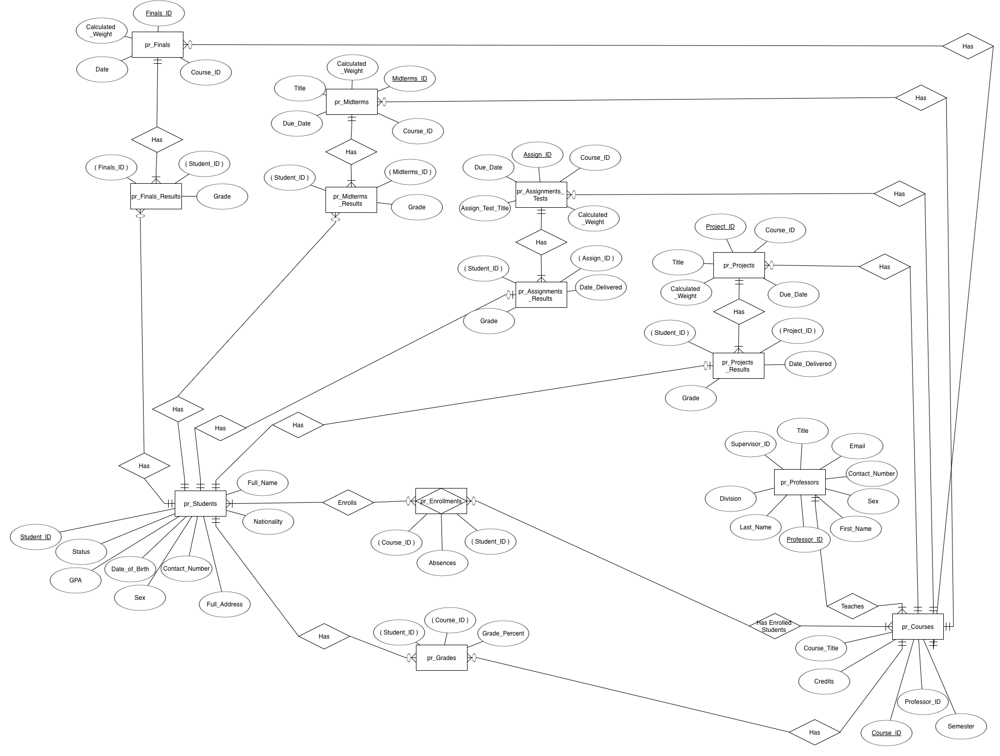
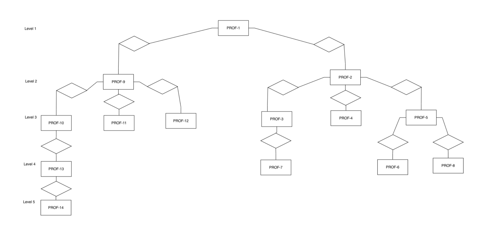

# College Database Management System (Oracle SQL & PL/SQL)

A relational database for managing a college's students, professors, courses, and grading. It automates the work that is usually done by hand: calculating final grades and GPAs, applying late-submission and absence penalties, tracking student activity status, building the Dean's List, and auditing changes to courses.

Built as the final project for **CS312: Database Management Systems** at the American College of Thessaloniki (Spring 2025).



## Features

- **13 normalized tables** covering students, professors, courses, enrollments, four assessment types (assignments/tests, projects, midterms, finals), their results, and final grades.
- **Many-to-many relationship** between students and courses (via enrollments), and a **self-referencing hierarchy** of professors (Dean → Chair → Senior Professor → ...).
- **~2,000 rows of generated sample data** for realistic testing.
- **Automated grading pipeline:** a view, function, and procedure compute every student's weighted final grade per course, then their GPA.
- **Business rules as PL/SQL:** late-submission penalties, absence penalties, ACTIVE/INACTIVE student status, removal of inactive students, and a Dean's List (GPA ≥ 3.5).
- **Triggers** that auto-assign student status and professor titles on insert, plus an audit trigger that logs every change to the courses table (what changed, on which course, and by whom).

## Tech Stack

- **Oracle Database** (SQL, PL/SQL)
- Hierarchical queries (`CONNECT BY`), correlated and non-correlated subqueries
- Views, user-defined functions, stored procedures, explicit and implicit cursors, sequences, triggers
- Excel (VBA-enabled workbook) for generating the sample data

## Database Schema

| Table | Purpose |
|---|---|
| `pr_Students` | Student details, plus calculated `GPA` and `Status` (ACTIVE/INACTIVE) |
| `pr_Professors` | Professor details, with `Supervisor_ID` (self-reference) and `Title` |
| `pr_Courses` | Courses, credits, semester, and the teaching professor |
| `pr_Enrolments` | Student ↔ course (M:N), including absences |
| `pr_Assignments_Tests`, `pr_Projects`, `pr_Midterms`, `pr_Finals` | Assessments per course, with weight and due date |
| `pr_Assignments_Results`, `pr_Projects_Results`, `pr_Midterms_Results`, `pr_Finals_Results` | Student results per assessment (composite primary keys) |
| `pr_Grades` | Final calculated grade per student per course |

The professor hierarchy:



## What the Queries Do

**Hierarchical queries:** list professors in hierarchical order with their level, count the levels and professors per division, show full reporting paths from the top, and assign titles by level.

**Subqueries:** students who scored above the average on each assignment (correlated), students with project grades above 80, total absences per student in a semester, and students with no enrollments in the last four semesters.

**Automation tasks** (run in order, since later steps depend on earlier ones):

1. Zero the grades of assignments and projects delivered after the due date
2. Calculate every student's weighted final grade for each course
3. Apply absence penalties to final grades
4. Calculate each student's GPA
5. Set each student's status to ACTIVE or INACTIVE
6. Delete inactive students
7. Build the Dean's List (GPA ≥ 3.5) using an explicit cursor
8. Report students who failed a course (grade < 40)
9. Look up a single student's GPA with an implicit cursor

**Triggers:** auto-assign status to new students, auto-assign titles to new professors, and audit all changes to courses.

## How to Run

1. Open an Oracle environment (Oracle Live SQL, SQL Developer, or a local Oracle instance).
2. Run **`COLLEGE_DATABASE_PROJECT(Data_Dump).sql`** to create the tables, constraints, and sample data.
3. Run **`College_Database_Queries_SQL.sql`**:
   - The hierarchical queries and subqueries can run in any order.
   - The automation tasks must run **in order**, since each builds on the previous step.
   - Enable `SET SERVEROUTPUT ON` to see the output of the cursor-based procedures.

## Project Structure

```
├── COLLEGE_DATABASE_PROJECT(Data_Dump).sql   # Schema, constraints, and sample data
├── College_Database_Queries_SQL.sql          # Queries, views, functions, procedures, triggers
├── data-generation/
│   └── College Data Base.xlsm                # Workbook used to generate sample data
└── docs/
    ├── COLLEGE_DATABASE_ERD.png              # Entity-relationship diagram
    ├── pr_Professors_Hierarchy_Diagram.png   # Professor hierarchy
    └── Final_Report.docx                     # Full project report
```

## Possible Improvements

- Add a web interface so students, professors, and administrators can use the system without writing SQL.
- Add role-based access for each user type.
- Extend the query set to cover more of a real college's reporting needs.

## Author

**Georgios Aslanidis**, BSc Computer Science, American College of Thessaloniki
